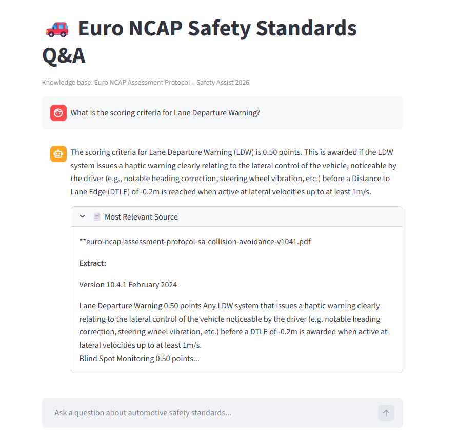

# RAG-based Automotive Safety Standards Q&A
 
A Retrieval-Augmented Generation (RAG) system that allows engineers and researchers to query official Euro NCAP automotive safety documentation using natural language. Built with LangChain, FAISS, OpenAI and Streamlit.
 
---
 
## 📸 Demo
 

 
---
 
## 🧠 How It Works
 
The system is split into two phases:
 
**Ingestion (runs once)**
1. Load all PDF documents from the `data/` folder
2. Split documents into overlapping text chunks
3. Convert chunks to vector embeddings using OpenAI
4. Store embeddings in a local FAISS vector index
 
**Query (runs on every question)**
1. Convert the user's question into a vector embedding
2. Search FAISS for the top 3 most semantically relevant chunks
3. Inject retrieved chunks as context into a strict prompt
4. Send prompt to GPT-4o-mini for answer generation
5. Display answer with the most relevant source document
 
---
 
## 📚 Knowledge Base
 
The system is built on 5 official Euro NCAP Safety Assist protocols:
 
| Document | Coverage |
|---|---|
| Assessment Protocol – Safety Assist & Collision Avoidance v10.4.1 | AEB, blind spot, lane departure |
| AEB Car-to-Car Test Protocol v4.3.1 | AEB C2C test scenarios and scoring |
| Assessment Protocol – Safe Driving v10.4 | Safe driving assessment criteria |
| Lane Support Systems Test Protocol v4.3 | LSS requirements and testing |
| SAS Test Protocol v2.0 | Safety assist system verification |
 
---
 
## 🚀 Getting Started
 
### Prerequisites
- Python 3.10+
- OpenAI API key — get one at [platform.openai.com](https://platform.openai.com)
 
### Installation
 
**1. Clone the repository**
```bash
git clone git@github.com:IbtahajQadri/RAG-EuroNCAP-Safety-QA.git
cd rag-system-Q&A
```
 
**2. Create and activate virtual environment**
```bash
python3 -m venv venv
source venv/bin/activate
```
 
**3. Install dependencies**
```bash
pip install -r requirements.txt
```
 
**4. Set up your API key**
 
Create a `.env` file in the project root:
```
OPENAI_API_KEY=your-api-key-here
```
 
**5. Add documents**
 
Place your Euro NCAP PDF documents in the `data/` folder. The ingestion script automatically loads all PDFs in that folder.
 
**6. Build the vector index**
```bash
python experiments/faiss_embeddings.py
```
 
This embeds all documents and saves the FAISS index locally. Only needs to run once, or whenever you add new documents.
 
**7. Run the app**
```bash
streamlit run experiments/app.py
```
 
Open `http://localhost:8501` in your browser.
 
---
 
## 💬 Example Questions
 
```
What are the criteria for blind spot monitoring?
What are the AEB car-to-car test requirements?
How is safe driving assessed by Euro NCAP?
What are the lane support system requirements?
```
 
---
 
## 🔧 Design 
 
**Strict prompt — document only**
The system is instructed to answer exclusively from retrieved context. If the answer is not found in the documents, it returns a clear "not found" message rather than hallucinating from GPT's general training. This is critical for a safety standards application where accuracy matters.
 
**Score threshold retrieval**
Chunks are only retrieved if their similarity score exceeds a threshold of 0.4. This prevents weakly related content from being passed to GPT as context, improving answer quality and reducing irrelevant responses.
 
**3 chunks retrieved, 1 source displayed**
GPT receives the top 3 relevant chunks for richer context and more complete answers. Only the most relevant source document is shown to the user to keep the interface clean.
 
**Local FAISS index**
The vector index is stored locally rather than using a cloud vector database. This keeps the project lightweight, free to run, and easy to reproduce — anyone can clone the repo, run the ingestion script, and have a working system in minutes.
 
---
 
## ⚠️ Known Limitations
 
- **Text only** — images, diagrams and charts within PDFs are not processed
- **Document coverage** — the system can only answer questions covered by the loaded documents
- **Table of contents pages** — occasionally retrieved as a source due to keyword overlap with actual content
- **English only** — optimised for English language queries and documents
 
---
 
## 🔮 Future Improvements
 
- Add support for image and diagram extraction using multimodal models
- Expand knowledge base with more Euro NCAP protocols and crash test reports
- Add conversation memory so follow-up questions reference previous answers
- Deploy as a web application using Streamlit Cloud
- Add a document upload feature so users can query their own PDFs
 
---
 
## 📁 Project Structure
 
```
RAG-EuroNCAP-Safety-QA/
│
├── data/                        # Euro NCAP PDF documents
│
├── experiments/                 # Development scripts (staged build)
│   ├── load_chunks.py           # PDF loading and chunking
│   ├── faiss_embeddings.py      # Embeddings and vector store
│   ├── retrieval.py             # Q&A retrieval chain
│   └── stage5_app.py            # Streamlit chat interface
│
├── assets/                      # Screenshot
│   └── demo.png
│
├── faiss_index/                 # Generated vector index (not tracked)
├── .env                         # API key (not tracked)
├── .gitignore
├── requirements.txt
└── README.md
```
 
---

## 👤 Author
**Ibtahaj Athar Qadri**

---

## 📄 Data Sources
 
All documents are official Euro NCAP test protocols, publicly available at [euroncap.com](https://www.euroncap.com/en/for-engineers/protocols/safety-assist/)